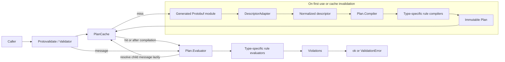
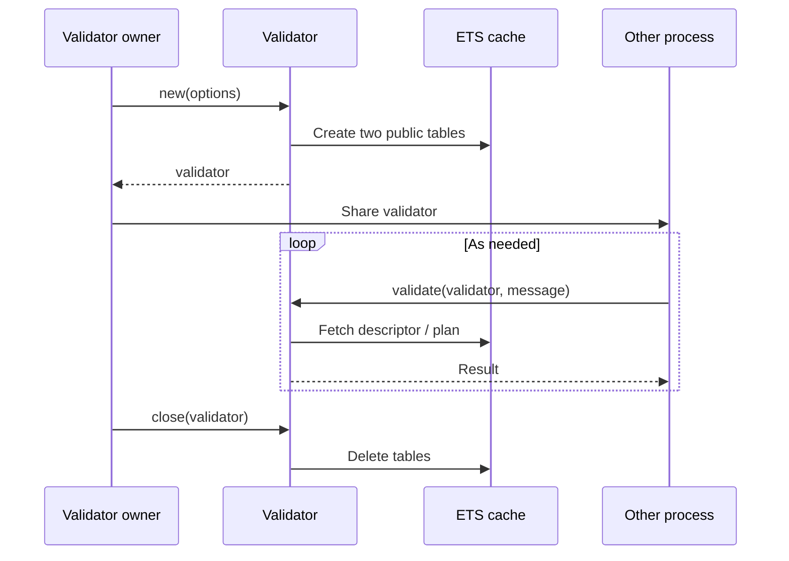
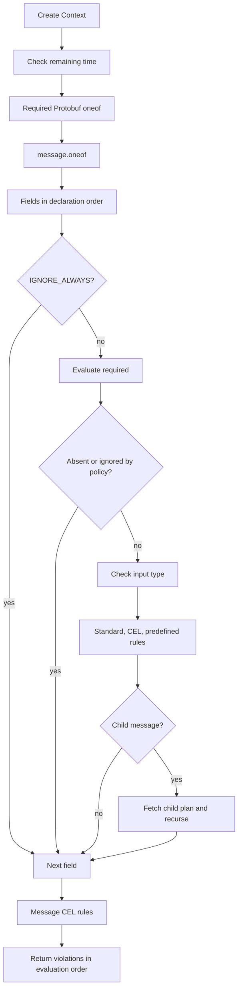
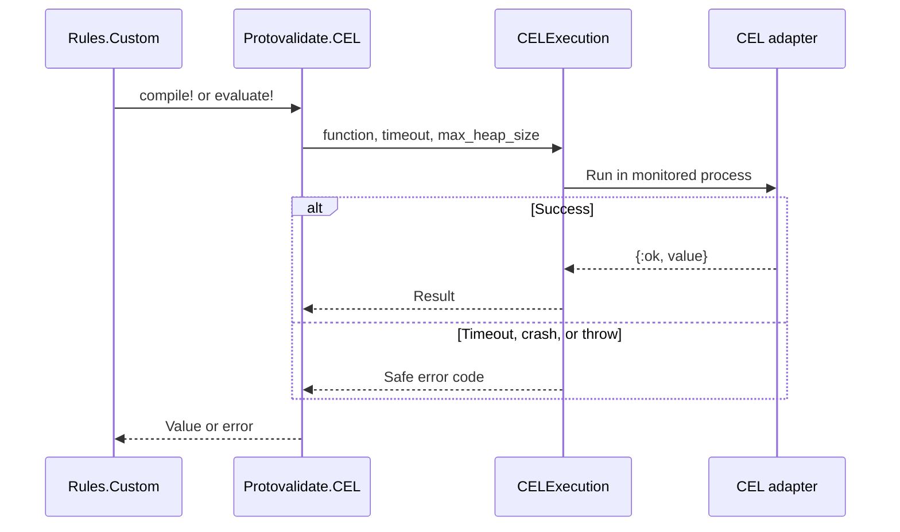

# Implementation architecture

This document explains how Protovalidate for Elixir reads validation rules from generated Protobuf messages and evaluates them. See the [public API and error contract](api-design.md) for the external interface and the [rule support table](rule-support.md) for individual rules. [日本語版](architecture_ja.md).

## Overview

The library is a descriptor-driven validator. Validation has two stages:

1. **Compilation:** Convert Protobuf descriptors and `buf.validate` extensions into an immutable <code>Protovalidate.Plan</code>.
2. **Evaluation:** Apply the plan to a message and collect `Protovalidate.Violation` values.

Compiled plans are stored in ETS tables owned by each validator. Repeated validations of a message type can reuse descriptor normalization and CEL compilation.



## Layers and responsibilities

| Layer | Main modules | Responsibility |
| --- | --- | --- |
| Public API | `Protovalidate`, `Protovalidate.Validator` | Validate options, manage validator lifetime, expose results and exceptions |
| Protobuf boundary | `Protovalidate.DescriptorAdapter` | Normalize protobuf-specific descriptors, field properties, and edition features |
| Cache | <code>Protovalidate.Validator.PlanCache</code> | Cache descriptors and plans, count hits and misses, detect code reloads, and resolve CEL field descriptors |
| Plan compilation | <code>Protovalidate.Plan.Compiler</code> | Compile field, oneof, and message CEL rules into evaluation data |
| Rules | Type-specific rule modules | Compile and evaluate rules by type |
| Plan evaluation | <code>Protovalidate.Plan.Evaluator</code>, <code>Protovalidate.Plan.Context</code>, <code>Protovalidate.InputBoundary</code> | Traverse messages, check input types, and manage presence, ignore, fail-fast, deadlines, and violation paths |
| CEL boundary | `Protovalidate.CEL`, <code>Protovalidate.CELExecution</code> | Invoke the CEL adapter with time and heap limits; normalize results and failures |
| Results | `Protovalidate.Violation`, `Protovalidate.FieldPath`, `Protovalidate.RuleSource`, `Protovalidate.ViolationCodec` | Represent violation location and descriptor source, and encode violations as `buf.validate` messages |

The rule dispatcher selects separate modules for strings, numbers, collections, well-known types, and other rule families during both compilation and evaluation.

## Public API and validator lifetime

`Protovalidate.validate/2` creates a validator for one call and always closes it afterward, so plans are not reused across calls. For repeated validation, create a validator with `Protovalidate.new/1` and call `Validator.validate/2` repeatedly. A validator holds normalized options, a compile configuration, and two ETS table IDs. It starts no resident process or OTP application process.



The process calling `new/1` owns the ETS tables. Other processes can share the validator while the owner is alive because the tables are public and support concurrent reads. The tables disappear when the owner exits. Call `close/1` from the owner after all users finish.

`Validator.prepare/2` compiles the target module and reachable child message modules ahead of validation, visiting recursive references once. It uses its own unbounded compilation budget and does not consume a later validation timeout.

## Compilation

### 1. Normalize descriptors

`DescriptorAdapter.describe/2` uses these generated-module APIs as its protobuf boundary:

- `descriptor/0`: Message, field, oneof, and option descriptors.
- `__message_props__/0`: Runtime field types, maps, repeated fields, and presence.
- `full_name/0`: Fully qualified Protobuf message name.
- Optional `__protovalidate_descriptor_context__/0`: Inherited edition and feature information when generated code provides it.

Generated modules need `gen_descriptors=true` to provide `descriptor/0`. The adapter restores `buf.validate` field, message, and oneof extensions from options and stores scalar and collection types, presence, referenced message modules, well-known type categories, resolved field features, and rules in normalized `DescriptorAdapter.Message`, `Field`, and `Oneof` values. Later stages use these normalized descriptors; runtime presence checks still call `Protobuf.field_presence/2`. Invalid generated modules and callback failures become `CompilationError` without exposing internal exception details.

### 2. Build plans

`Plan.Compiler` creates a plan with the following parts:

```text
Plan
├── module: target Elixir module
├── fields: field descriptors and compiled rules
├── oneofs: required Protobuf oneof rules
├── message_oneofs: buf.validate message.oneof rules
├── wire_fields: field elements for encoded violation paths
└── cel_rules: compiled message-level CEL rules
```

Compilation rejects unknown rule fields, type mismatches, invalid ranges, and duplicate CEL rule IDs. Standard rules become evaluation data such as comparison values and regular expressions; CEL rules retain adapter-compiled expressions. Configuration errors independent of message values are therefore found when the plan is first built.

Repeated `items` and map `keys` / `values` use virtual element field descriptors and the ordinary field rule compiler. A repeated field always has an item plan, and a map always has a value plan; a map key plan is created only when `keys` rules exist. This also enables child-message validation without explicit element rules. Scalar, message, and CEL rules within collections follow the same path.

### 3. Cache plans

A validator stores descriptors and plans in one ETS table and hit/miss counters in another. A plan key conceptually contains:

```text
{:plan, message_module, {module_version, referenced_module_versions}, compile_config}
```

The loaded BEAM MD5 identifies each module version. A direct low-level descriptor call instead keys by the complete normalized descriptor and dependency versions. The compile configuration contains `:cel`, `:legacy_required`, and `:registry`, plus an internal `:cel_descriptor_resolver` tied to the validator's descriptor cache. The resolver lets CEL access field descriptors without normalizing them again. `:fail_fast` and `:validation_timeout` affect evaluation and can share a plan.

Each plan lookup records its version as the current generation for that module and prunes plans from other generations. Concurrent misses for the same key share a compilation lock; waiting callers can take over if its owner exits. If a compilation finishes while another generation is recorded, its original caller can use that plan, but that plan is removed from the cache. The generation record follows lookup order, including concurrent lookups during code reload; it does not enforce a monotonic version order.

## Evaluation

`Plan.Evaluator` accepts only messages of the plan's module. It evaluates in this order:



`Plan.Context` threads evaluation state through function returns. It holds accumulated violations, the field/index/map-key path, collection rule path prefixes, fail-fast status, a validation budget, the `now` value shared by CEL rules, and descriptor and wire path information for the current rule. Violations are prepended and reversed before return. With `:fail_fast`, evaluation stops after the first violation.

### Presence and ignore

Evaluation checks `Protobuf.field_presence/2` as well as the value, distinguishing an unset field with explicit presence from an implicit-presence zero value. The order is `IGNORE_ALWAYS`, `required`, skip for absent fields or zero values under an applicable ignore policy, then input type checks and remaining rules. `IGNORE_IF_ZERO_VALUE` and `IGNORE_IF_DEFAULT_VALUE` skip zero values only for implicit-presence fields and collection elements. Once `required` fails, other rules do not add redundant violations for the missing field. Invalid values that reach the input check become `RuntimeError` with an input-stage code.

### Nested and recursive messages

A child plan is fetched for the actual message module only when a message field has a value, after checking it against the descriptor's expected type. References are not expanded recursively during plan compilation, allowing self-referential and mutually recursive message types. Child evaluation extends the parent's context and path with field names, repeated indices, and map keys. The repeated item and map value plans handle child evaluation even without explicit `items` or `values` rules, so child violations are reported once.

## CEL and predefined rules

The default CEL adapter is `Protovalidate.CEL.Celixir`. `Protovalidate.CEL` defines the adapter interface, and `CELExecution` runs compile and evaluate calls in monitored processes.



The child process has a timeout and maximum heap size. Exceptions, throws, exits, and invalid adapter results become fixed errors without exposing original exceptions or input values. A CEL result of `true` or an empty string succeeds; `false` yields a violation with the defined message; a nonempty string becomes the violation message.

Predefined rules normalize field-rule extensions by extension number and resolve them through an explicitly supplied `PredefinedRuleRegistry`. CEL rules returned by the registry use the same compile and evaluate path. Unregistered extensions raise `UnsupportedRuleError` rather than being silently ignored.

## Violation representation

Each `Violation` distinguishes three kinds of location:

| Property | Meaning | Example |
| --- | --- | --- |
| `field_path` | Location in the input message | Field, repeated index, map key |
| `rule_path` | Logical path of the applied rule | `string.min_len`, `repeated.items.string.email` |
| `rule_source` | Location in the defining descriptor | Root rules message, field/index segments, extension descriptor |

`FieldPath` uses typed segments. Map keys retain their string, boolean, signed, or unsigned kind and value instead of being converted to strings. A map key rule violation also sets `for_key` to `true`. Violations do not retain the input value, reducing accidental copying of sensitive input into logs or external responses.

`Violation.origin` holds the constraint kind and Protobuf wire paths used by `ViolationCodec` to produce `buf.validate.Violation` messages. It is assembled from the current descriptor and path context during evaluation.

## Error boundary

`Validator.validate/2` classifies results as follows:

| Result | Origin | Meaning |
| --- | --- | --- |
| `{:ok, message}` | Evaluation complete | No violations; returns the original struct |
| `ValidationError` | Plan evaluation | Input violates one or more rules |
| `CompilationError` | Descriptor normalization or plan/CEL compilation | Invalid schema or generated code |
| `UnsupportedRuleError` | Plan compilation | Unsupported or unregistered rule |
| `RuntimeError` | Input boundary, plan/CEL evaluation | Invalid message or field type, timeout, CEL execution failure, etc. |

`Protovalidate.validate!/2` raises these error results as exceptions.

## Concurrency and deadlines

Plans and descriptors are immutable after retrieval from ETS. Each call keeps its evaluation state in `Plan.Context`, so processes can use the same validator concurrently.

`:validation_timeout` becomes a deadline when `Validator.validate/2` starts. Descriptor resolution, root and child plan compilation, fields, oneofs, collection elements, and CEL calls share that budget. CEL compile/evaluate receives the shorter of its own timeout and the remaining validation budget. Ordinary Elixir rules check deadlines cooperatively; a running operation such as a regular expression is not forcibly interrupted.

Timestamp rules and CEL `now` use a time captured once at validation start, keeping results consistent within the call.

## Telemetry

Validation through a validator emits call phase, message, validation completion, and plan cache hit/miss events. See [Telemetry](telemetry.md) for event names, measurements, and metadata. Direct low-level calls to `Plan.evaluate/3` bypass validator telemetry.

## Conformance harness entry point

`mix protovalidate.conformance` runs `Protovalidate.Conformance.Executor`. It reads a conformance request from standard input and writes a response to standard output. For each case, `Conformance.RuntimeDescriptorAdapter` builds Protobuf modules from the request's file descriptor set, decodes the `Any` payload, and creates a predefined-rule registry. The executor calls the ordinary `Protovalidate.validate/2` path with that registry, then converts violations with `ViolationCodec` or maps errors to conformance results. This is a separate input boundary around the same validation pipeline.

## Where to make changes

- Public API or options: `Protovalidate.Validator`.
- Information read from descriptors: `Protovalidate.DescriptorAdapter`.
- Standard rules: the relevant type-specific rule module and the rule dispatcher.
- Field traversal or nested evaluation order: <code>Protovalidate.Plan.Evaluator</code>.
- Input type checks: <code>Protovalidate.InputBoundary</code>.
- Violation path composition: <code>Protovalidate.Plan.Context</code>.
- Wire-format violation encoding: `Protovalidate.ViolationCodec` and <code>Protovalidate.ViolationPath</code>.
- CEL adapter contract: `Protovalidate.CEL`.
- Cache keys or ownership: <code>Protovalidate.Validator.PlanCache</code>.
- Conformance request decoding and runtime module construction: <code>Protovalidate.Conformance.Executor</code> and <code>Protovalidate.Conformance.RuntimeDescriptorAdapter</code>.

For new rules, keep compile-time checks and evaluation in the same feature module. Detect errors independent of input values during compilation and pass validated internal data to evaluation.
