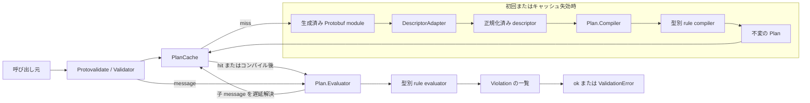
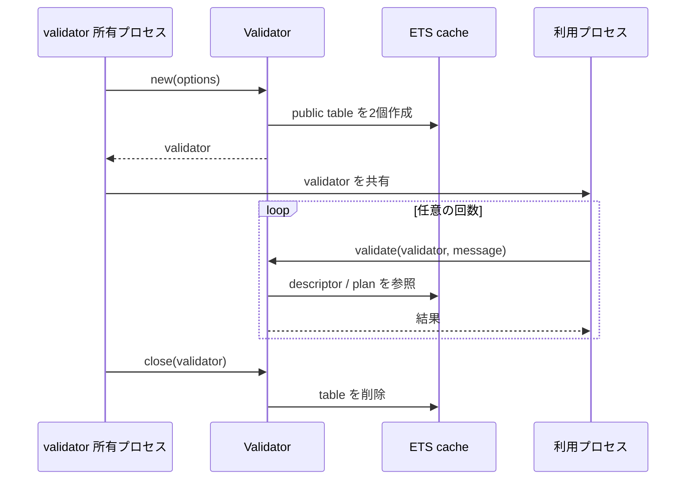
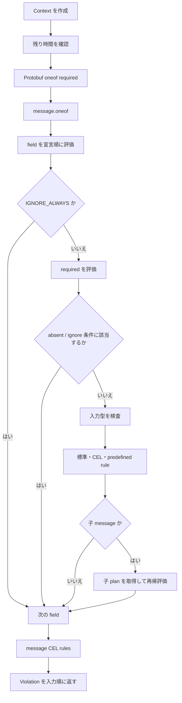
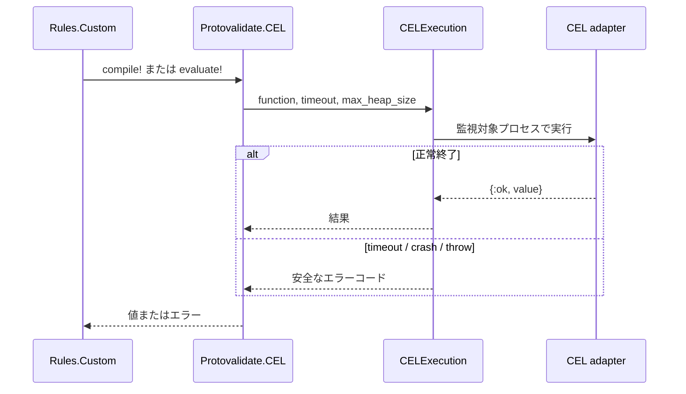

# 実装アーキテクチャ

この文書は、Protovalidate for Elixir が生成済み Protobuf メッセージから検証規則を読み取り、実行するまでの仕組みを説明します。公開 API の契約は[公開 API とエラー契約](api-design_ja.md)、個々の規則の対応状況は[ルール対応表](rule-support_ja.md)を参照してください。[English](architecture.md)。

## 設計の概要

本ライブラリは、生成済みメッセージに含まれる descriptor を実行時に読み取る descriptor 駆動の検証器です。検証処理は次の二段階に分かれます。

1. **コンパイル**: Protobuf descriptor と `buf.validate` extension を、評価しやすい不変の <code>Protovalidate.Plan</code> に変換する
2. **評価**: plan をメッセージ値へ適用し、違反を `Protovalidate.Violation` として収集する

コンパイル結果は validator ごとの ETS に保存されます。同じ型を繰り返し検証するときは、descriptor の読み取りや CEL 式のコンパイルを繰り返しません。



## レイヤーと責務

| レイヤー | 主なモジュール | 責務 |
| --- | --- | --- |
| 公開 API | `Protovalidate`, `Protovalidate.Validator` | オプション検証、validator のライフサイクル、結果と例外の公開 |
| Protobuf 境界 | `Protovalidate.DescriptorAdapter` | `protobuf` ライブラリ固有の descriptor、field props、edition feature を内部表現へ正規化 |
| キャッシュ | <code>Protovalidate.Validator.PlanCache</code> | descriptor と plan の ETS キャッシュ、hit / miss の計測、コード再ロードの検出、CEL 用 field descriptor の解決 |
| plan コンパイル | <code>Protovalidate.Plan.Compiler</code> | field、oneof、message CEL の規則を評価用データへ変換 |
| 規則 | 型ごとの規則モジュール | 型ごとの規則のコンパイルと評価 |
| plan 評価 | <code>Protovalidate.Plan.Evaluator</code>, <code>Protovalidate.Plan.Context</code>, <code>Protovalidate.InputBoundary</code> | message の走査と入力型検査、presence、ignore、fail-fast、期限、違反パスの管理 |
| CEL 境界 | `Protovalidate.CEL`, <code>Protovalidate.CELExecution</code> | CEL adapter の呼び出し、timeout とヒープ上限、戻り値と障害の正規化 |
| 結果 | `Protovalidate.Violation`, `Protovalidate.FieldPath`, `Protovalidate.RuleSource`, `Protovalidate.ViolationCodec` | 違反箇所と規則定義の出典を表現し、違反を `buf.validate` メッセージへ変換 |

規則のディスパッチャは、文字列、数値、collection、well-known type などの実装を担う独立したモジュールを、コンパイル時と評価時の両方で field の型に応じて選びます。

## 公開 API と validator のライフサイクル

`Protovalidate.validate/2` は単発実行用です。呼び出しの中で validator を作り、検証後に必ず `Validator.close/1` を呼びます。このため使いやすい一方、呼び出しをまたいで plan は再利用されません。

高頻度の検証では `Protovalidate.new/1` で validator を作成し、`Validator.validate/2` を繰り返し呼びます。validator は正規化済みの設定、コンパイル設定、二つの ETS table ID を持つ構造体で、常駐プロセスや OTP application process は起動しません。



ETS table は `new/1` を呼んだプロセスが所有します。table は `:public` かつ読み取り並行性を有効にしているため、validator 自体は複数プロセスから共有できます。ただし、所有プロセスが終了すると table も削除されます。全利用プロセスの検証が終わった後、所有プロセスから `close/1` を呼ぶ必要があります。

`Validator.prepare/2` は指定した module と到達可能な子 message の plan を検証前にコンパイルします。再帰参照は一度だけ訪問します。準備処理は独立した無期限のコンパイル予算を使い、後の検証呼び出しの timeout を消費しません。

## コンパイル処理

### 1. descriptor の正規化

`DescriptorAdapter.describe/2` は生成済みモジュールの次の API を Protobuf 実装との境界にします。

- `descriptor/0`: message、field、oneof、option の descriptor
- `__message_props__/0`: Elixir 上の型、map、repeated、presence などの実行時情報
- `full_name/0`: Protobuf の完全修飾 message 名
- 任意の `__protovalidate_descriptor_context__/0`: 生成コードが提供する場合に、継承された edition と feature の情報を取得

`gen_descriptors=true` なしで生成したモジュールは `descriptor/0` を持たないため利用できません。

adapter は `buf.validate` の field、message、oneof extension を option から復元し、内部の `DescriptorAdapter.Message`、`Field`、`Oneof` に格納します。この内部表現には次の情報が集約されます。

- scalar、enum、message などの field 型
- repeated と map の要素型
- implicit、explicit、required、oneof の presence
- 参照先 message module
- well-known type の分類
- 解決済みの field feature
- 復元した検証規則

後続の処理はこの正規化済み descriptor を使います。ただし、実際の値の presence 判定には `Protobuf.field_presence/2` を呼びます。不正な生成モジュールや callback の失敗は、内部例外の詳細を露出せず `CompilationError` に変換されます。

### 2. plan の生成

`Plan.Compiler` は正規化済み descriptor から次の構造を持つ `Plan` を作ります。

```text
Plan
├── module: 対象の Elixir module
├── fields: field descriptor とコンパイル済み規則
├── oneofs: Protobuf oneof の required 規則
├── message_oneofs: buf.validate の message.oneof 規則
├── wire_fields: 違反の wire path を構築する field 要素
└── cel_rules: message レベルのコンパイル済み CEL 規則
```

コンパイル時には、未知の rule field、型と規則の不一致、不正な範囲、重複した CEL rule ID などを検査します。標準規則は比較に必要な値や正規表現などへ変換され、CEL 規則は CEL adapter が返すコンパイル済み式を plan に保持します。そのため、入力値に依存しない設定エラーは初回の plan 作成時に検出されます。

repeated の `items` と map の `keys` / `values` は、要素用の仮想 field descriptor を作り、通常の field rule compiler を再利用します。repeated には常に item plan、map には常に value plan を作り、map の key plan は `keys` 規則がある場合だけ作ります。このため、要素規則が明示されなくても子 message を検証できます。collection の内側でも scalar、message、CEL の規則を同じ経路で扱います。

### 3. plan キャッシュ

validator は一つの ETS table に descriptor と plan を保存し、別の ETS table に hit と miss の counter を保存します。

plan のキーは概念的に次の組です。

```text
{:plan, message_module, {module_version, referenced_module_versions}, compile_config}
```

`module_version` と参照先 module の版にはロード済み BEAM の MD5 を使います。低レベル API から descriptor を直接渡す場合は、正規化済み descriptor 全体と依存 module の版をキーに使います。`compile_config` には `:cel`、`:legacy_required`、`:registry` に加えて、validator の descriptor キャッシュに結び付いた内部の `:cel_descriptor_resolver` が含まれます。CEL はこの resolver を使い、field descriptor の再正規化を避けます。`:fail_fast` と `:validation_timeout` は評価時の設定なので、同じ plan を共有できます。

plan を参照するたびに、その module の現在の世代として参照時の版を記録し、他の世代の plan を削除します。同じキーのキャッシュ miss が並行した場合はコンパイル用の lock を共有し、担当プロセスが終了すると待機側が引き継げます。別の世代が記録されている間にコンパイルが完了した場合、その呼び出し元は plan を使えますが、plan はキャッシュから除去されます。世代の記録はコード再ロード中の並行した参照も含めて参照順に従い、版が単調に新しくなることは保証しません。

## 評価処理

`Plan.Evaluator` は plan と同じ module のメッセージだけを受け付けます。評価順序は次の通りです。



`Plan.Context` は評価中の可変状態を関数の戻り値として運びます。主に次を保持します。

- 収集済みの違反と件数
- 現在の field、list index、map key からなる path
- collection 内部の rule path prefix
- `fail_fast` による停止状態
- 検証全体の deadline
- 全 CEL 規則で共有する `now`
- 現在評価中の規則の descriptor 上の出典
- wire 形式の field path を組み立てるための情報

違反はリストの先頭へ追加し、最後に反転します。通常は安定した評価順で全違反を返し、`:fail_fast` が有効なら最初の違反を追加した時点で `Enum.reduce_while/3` を停止します。

### presence と ignore

field の評価では、値だけでなく `Protobuf.field_presence/2` の結果を使います。explicit presence を持つ field の未設定と、implicit presence のゼロ値を区別するためです。

処理順は `IGNORE_ALWAYS`、`required`、absent または適用可能な ignore policy に基づくゼロ値の skip、入力型検査、その他の規則です。`IGNORE_IF_ZERO_VALUE` と `IGNORE_IF_DEFAULT_VALUE` によるゼロ値の skip は、implicit presence の field と collection の要素にだけ適用されます。required 違反が発生した field に残りの規則を重ねて適用しないため、同じ欠落値から不要な違反が複数生成されません。入力型検査まで到達した不正な値は、入力段階を示すコードを持つ `RuntimeError` になります。

### nested message と再帰型

message field に値が存在するときは、descriptor が期待する型との照合後に、その実際の module に対応する子 plan を取得します。コンパイル時に参照先の plan を再帰展開しないため、自己参照や相互参照を持つ Protobuf 型でも無限に plan を作りません。

子 message の評価では親の `Context` を引き継ぎ、field path を追加します。repeated message では index、map value の message では map key も path に追加されるため、深い入れ子でも入力上の位置を失いません。

repeated の item plan と map の value plan は、`items` または `values` 規則が明示されていなくても子 message を評価します。子 message の違反は一度だけ報告されます。

## CEL と predefined rule

標準の CEL adapter は `Protovalidate.CEL.Celixir` です。`Protovalidate.CEL` が adapter interface を定義し、`CELExecution` が compile と evaluate の各呼び出しを専用プロセスで実行します。



子プロセスには timeout と最大ヒープサイズが設定されます。adapter の例外、throw、exit、異常な戻り値は固定されたエラーへ変換され、元の例外値や入力値は公開されません。評価結果は `true` または空文字列なら成功、`false` なら定義済みメッセージの違反、空でない文字列ならその文字列をメッセージとする違反です。

predefined rule は field rule extension を extension number へ正規化し、明示的に渡された `PredefinedRuleRegistry` で解決します。registry が返す CEL rule も同じ compile、evaluate 経路を通ります。未登録の extension は暗黙に無視されず `UnsupportedRuleError` になります。

## 違反の表現

各 `Violation` は次の三つの位置情報を区別します。

| 情報 | 内容 | 例 |
| --- | --- | --- |
| `field_path` | 入力メッセージ内の違反位置 | field、repeated index、map key |
| `rule_path` | 適用した規則の論理パス | `string.min_len`、`repeated.items.string.email` |
| `rule_source` | 規則が定義された descriptor 上の位置 | root rules message、field/index segments、extension descriptor |

`field_path` は `FieldPath` の型付き segment で表現します。map key は文字列化せず、string、bool、signed、unsigned の種別と値を保持します。map の key rule による違反では `for_key` も `true` になります。

`Violation` は検証対象の実値を保持しません。エラーのログ記録や外部レスポンスへの変換時に、入力中の機密情報を意図せず複製しにくい構造です。

`Violation.origin` には制約の種類と Protobuf の wire path を保持します。評価中の descriptor と path context から組み立てられ、`ViolationCodec` が `buf.validate.Violation` メッセージを作る際に使います。

## エラー境界

`Validator.validate/2` は検証結果を次のように分類します。

| 結果 | 発生箇所 | 意味 |
| --- | --- | --- |
| `{:ok, message}` | 評価完了 | 違反なし。元の構造体をそのまま返す |
| `ValidationError` | plan 評価 | 入力値が一つ以上の規則に違反した |
| `CompilationError` | descriptor 正規化、plan / CEL コンパイル | schema または生成コードが不正 |
| `UnsupportedRuleError` | plan コンパイル | 未対応または未登録の規則がある |
| `RuntimeError` | 入力境界、plan / CEL 評価 | 不正な message や field の型、timeout、CEL 実行障害など |

`Protovalidate.validate!/2` はこれらの error tuple を例外として raise する薄い wrapper です。

## 並行実行と時間制限

plan と descriptor は不変で、ETS から読み取った後に書き換えません。評価状態は各呼び出しの `Plan.Context` に閉じているため、同じ validator を複数プロセスから並行利用できます。

`:validation_timeout` は `Validator.validate/2` の入口で deadline へ変換され、descriptor 解決、root と子 plan のコンパイル、field、oneof、collection 要素、CEL 呼び出しで同じ budget を共有します。CEL の compile / evaluate timeout には検証全体の残り時間と CEL 固有 timeout の短い方を渡します。通常の Elixir 規則は協調的に期限を確認するため、一つの正規表現などの実行途中を強制停止する仕組みではありません。

`timestamp` 規則と CEL の `now` は、検証開始時に一度だけ取得した同じ時刻を使います。評価中に時刻が進んでも、一回の検証内では結果がぶれません。

## Telemetry

validator 経由の処理では、呼び出しの各段階、message、検証終了、plan cache の hit / miss を Telemetry で通知します。イベント名と measurements、metadata は [Telemetry](telemetry_ja.md) を参照してください。低レベルの `Plan.evaluate/3` を直接呼ぶ場合は validator の計測境界を通りません。

## conformance harness の入口

`mix protovalidate.conformance` は `Protovalidate.Conformance.Executor` を実行し、標準入力から conformance request を読み、標準出力へ response を書きます。各 case では `Conformance.RuntimeDescriptorAdapter` が request の file descriptor set から Protobuf module を作り、`Any` の内容を decode して predefined rule registry を作成します。executor はこの registry を渡して通常の `Protovalidate.validate/2` を呼び、`ViolationCodec` で違反を変換するか、エラーを conformance result に対応付けます。これは同じ検証パイプラインを使う別の入力境界です。

## 実装を変更するときの入口

- 公開 API や option を追加する: `Protovalidate.Validator`
- descriptor から取得する情報を追加する: `Protovalidate.DescriptorAdapter`
- 新しい標準規則を追加する: 対応する型ごとの規則モジュールと規則のディスパッチャ
- field traversal や入れ子の評価順を変更する: <code>Protovalidate.Plan.Evaluator</code>
- 入力型検査を変更する: <code>Protovalidate.InputBoundary</code>
- 違反 path の合成を変更する: <code>Protovalidate.Plan.Context</code>
- wire 形式の違反への変換を変更する: `Protovalidate.ViolationCodec` と <code>Protovalidate.ViolationPath</code>
- CEL adapter の契約を変更する: `Protovalidate.CEL`
- cache key や所有方式を変更する: <code>Protovalidate.Validator.PlanCache</code>
- conformance request の decode と実行時 module の構築を変更する: <code>Protovalidate.Conformance.Executor</code> と <code>Protovalidate.Conformance.RuntimeDescriptorAdapter</code>

規則を追加するときは、コンパイル時の入力検査と評価時の処理を同じ feature module に置きます。入力値に依存しない誤りはコンパイル時に検出し、評価処理には検証済みの内部表現だけを渡すのが既存実装の基本方針です。
